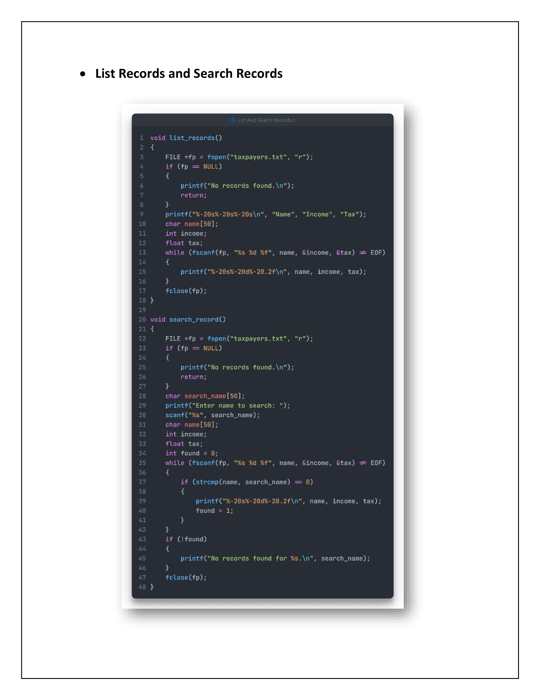
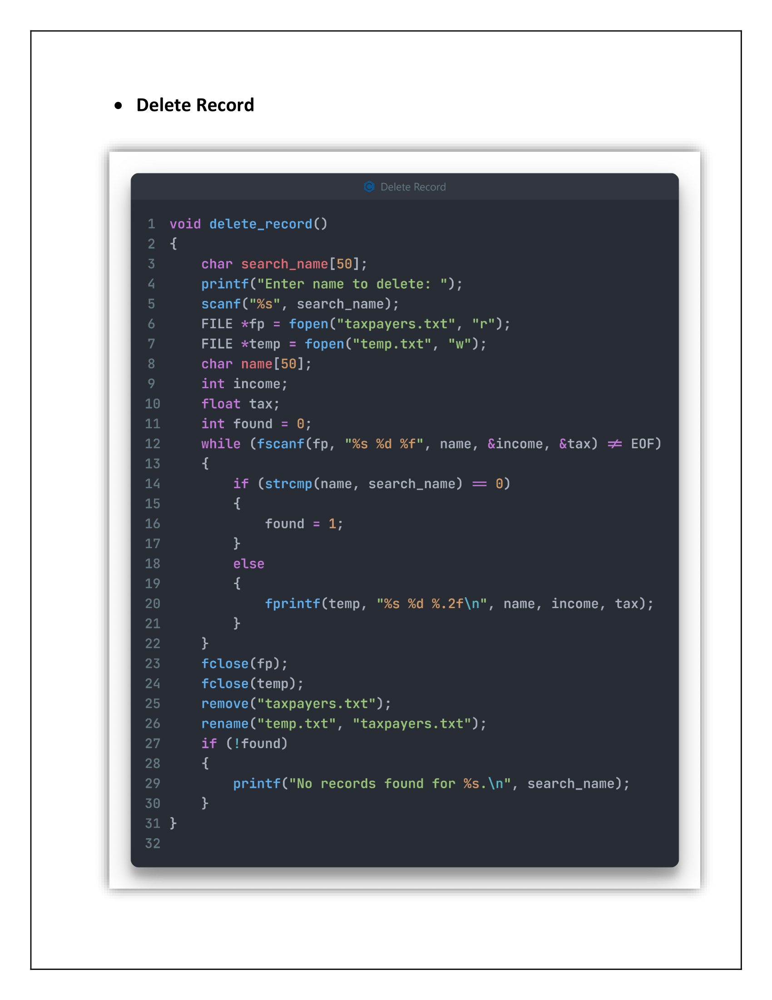
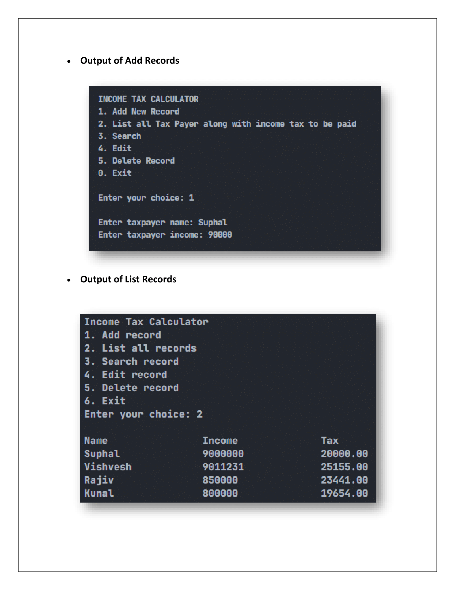
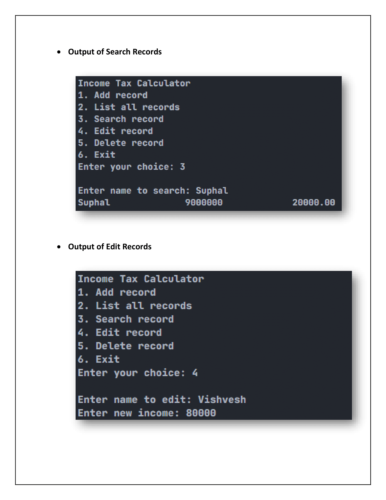
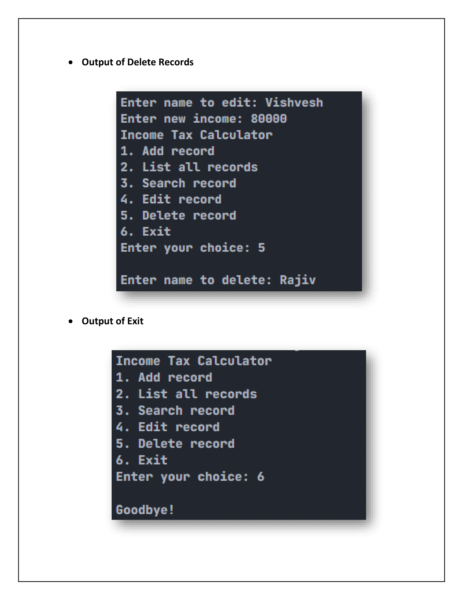

#

---

# Income Tax Calculator in C

## Introduction

An income tax calculator is a tool that helps taxpayers calculate the amount of tax they owe to the government based on their income. It takes into account the income tax slabs and rates set by the government and computes the tax liability based on the taxpayer's income. This project aims to create an income tax calculator in C that can store the records of taxpayers and perform various operations on them.

The main objectives of this project are:

- To develop a program that assists taxpayers in calculating their income tax quickly and accurately.
- To allow users to input their income details and calculate the tax liability based on the income tax slabs and rates.
- To store taxpayer records in an array, which can be used to retrieve, edit, or delete records as required.

The program will have five modules:

1. Adding a new record
2. Listing all taxpayers along with the income tax to be paid
3. Searching for a specific record
4. Editing a record
5. Deleting a record

This project will help users easily calculate their income tax liability and manage their tax records efficiently. It will also be a useful tool for students learning programming in C and data management techniques.

## Modules Explanation

### 1. Add New Record

This module allows the user to add a new record of a taxpayer to the system. The program will prompt the user to enter details such as name, age, income, and other relevant information. The program will then validate the input and store the information in an array. A confirmation message will be displayed once the record has been successfully added.

### 2. List All Taxpayers Along with Income Tax to be Paid

This module allows the user to list all taxpayers along with the income tax to be paid. The program will calculate the income tax liability based on the income tax slabs and rates, and display the result for each taxpayer. The user will see the name, age, income, tax slab, tax rate, and tax liability of each taxpayer, along with the total tax liability for all taxpayers combined.

### 3. Search

This module allows the user to search for a specific taxpayer by name or other relevant information. The program will prompt the user to enter the name or other relevant information and search the array for the matching record. It will display the details of the matching record, including name, age, income, tax slab, tax rate, and tax liability.

### 4. Edit

This module allows the user to edit the details of a specific taxpayer. The program will prompt the user to enter the name or other relevant information to identify the record. It will display the existing details of the taxpayer, and the user can modify the information as required. The record in the array will be updated, and a confirmation message will be displayed once the record has been successfully edited.

### 5. Delete Record

This module allows the user to delete a specific taxpayer record from the system. The program will prompt the user to enter the name or other relevant information to identify the record. The program will then delete the record from the array and update the list of taxpayers accordingly. A confirmation message will be displayed once the record has been successfully deleted.

Overall, these modules provide the user with a comprehensive set of features for managing their tax records. The program offers a user-friendly interface and error handling mechanisms to ensure a smooth user experience.

Sure, here's a nicely formatted version of your Data Flow Diagram (DFD):

## Data Flow Diagram (DFD)

```plaintext
+-----------------------+
| Income Tax Calculator |
+-----------------------+
               |
+----------------+--------------------+--------+------+---------------+
| Add New Record | List All Taxpayers | Search | Edit | Delete Record |
+----------------+--------------------+--------+------+---------------+
               |                                              |
+--------------+---------------+                      +--------------+
|   Input Data | Validate Data |                      |  Input Data  |
+--------------+---------------+                      +--------------+
               |                                              |
+--------------+---------------+              +---------------+-----------------+
| Store Data   | Validate Data |              |   Search Data | Display Results |
+--------------+---------------+              +---------------+-----------------+
               |                                              |
+--------------------------+                          +---------------+
|  Calculate Tax Liability |                          |  Save Changes |
+--------------------------+                          +---------------+
               |                                              |
+-------------------------+                                   |
|     Display Data        |                                   |
+-------------------------+                                   |
               |                                              |
+---------------------+                           +---------------------+
|  Delete Data Record |                           |  Delete Data Record |
+---------------------+                           +---------------------+
```

# Programming Code

<details>

### Add New Record


### List All Taxpayers



### Search


### Delete Record



### Main Program


</details>

# Output Snapshot

<details>

### Output 1



### Output 2



### Output 3



</details>
